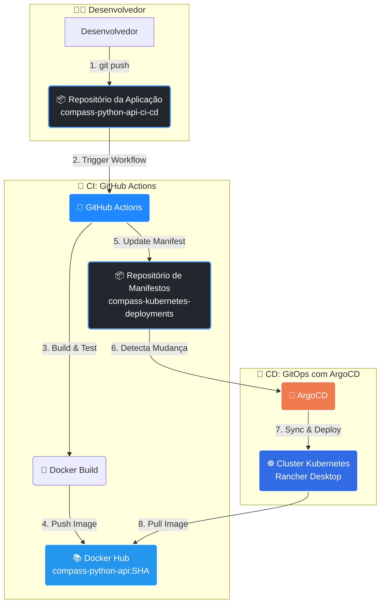

<div align="center">


# 🚀 Pipeline CI/CD com GitHub Actions, ArgoCD e Kubernetes

[](https://github.com/features/actions)
[](https://argo-cd.readthedocs.io/)
[](https://kubernetes.io/)
[](https://fastapi.tiangolo.com/)
[](https://hub.docker.com/)

**Implementação completa de pipeline CI/CD automatizado utilizando GitOps para uma aplicação FastAPI**

[Sobre](#-sobre-o-projeto) • [Arquitetura](#-arquitetura) • [Tecnologias](#-tecnologias) • [Demonstração](#-demonstração) • [Como Usar](#-como-usar)

</div>

---

## 📋 Sobre o Projeto

Este projeto foi desenvolvido como parte do **Programa de Bolsas - DevSecOps da Compass UOL** e demonstra a implementação completa de um pipeline CI/CD moderno, automatizando todo o ciclo de vida de uma aplicação desde o desenvolvimento até o deploy em produção.

### 🎯 Objetivos

- ✅ Automatizar o processo de **build**, **teste** e **deploy** de aplicações
- ✅ Implementar práticas de **GitOps** com ArgoCD
- ✅ Utilizar **GitHub Actions** para integração contínua
- ✅ Gerenciar deployments em **Kubernetes** de forma declarativa
- ✅ Separar responsabilidades entre código da aplicação e manifests de infraestrutura

### 🌟 Diferenciais

- **Totalmente Automatizado**: Um simples `git push` dispara todo o pipeline
- **GitOps**: O repositório Git é a única fonte de verdade
- **Rastreabilidade**: Cada deploy é versionado e rastreável
- **Rollback Simplificado**: Reverter para versões anteriores é trivial

---

## 🏗️ Arquitetura

### Fluxo do Pipeline



### Componentes Principais

| Componente | Função | Responsabilidade |
|------------|--------|------------------|
| **GitHub Actions** | CI Pipeline | Build, test e push da imagem Docker |
| **Docker Hub** | Registry | Armazenamento de imagens containerizadas |
| **ArgoCD** | CD Engine | Sincronização GitOps e deploy no K8s |
| **Kubernetes** | Orchestrator | Execução e gerenciamento dos containers |
| **Git Repositories** | Source of Truth | Versionamento de código e manifestos |

---

## 🛠️ Tecnologias Utilizadas

<table>
<tr>
<td align="center" width="33%">

### Integração Contínua
**GitHub Actions**
- Workflows automatizados
- Matrix builds
- Secret management
- Triggers configuráveis

</td>
<td align="center" width="33%">

### Containerização
**Docker & Docker Hub**
- Multi-stage builds
- Image optimization
- Tag versionamento (SHA)
- Registry público/privado

</td>
<td align="center" width="33%">

### Orquestração
**Kubernetes**
- Deployments
- Services (ClusterIP)
- Health checks
- Resource limits

</td>
</tr>
<tr>
<td align="center" width="33%">

### GitOps
**ArgoCD**
- Continuous Delivery
- Auto-sync
- Rollback automático
- UI declarativa

</td>
<td align="center" width="33%">

### Aplicação
**FastAPI**
- API REST moderna
- Auto-documentação
- Alta performance
- Type hints (Python)

</td>
<td align="center" width="33%">

### Desenvolvimento Local
**Rancher Desktop**
- Kubernetes local
- Docker runtime
- K3s distribution
- Easy setup

</td>
</tr>
</table>

---

## 📁 Estrutura dos Repositórios

Este projeto segue a prática de **separação de responsabilidades** com dois repositórios distintos:

### 1️⃣ Repositório da Aplicação
**`compass-python-api-ci-cd`** - Código fonte e CI

```
compass-python-api-ci-cd/
├── .github/
│   └── workflows/
│       └── main.yml          # 🎯 Pipeline CI/CD
├── .gitignore
├── Dockerfile                # 🐳 Containerização
├── main.py                   # 🚀 Aplicação FastAPI
├── requirements.txt          # 📦 Dependências Python
└── README.md
```

**Responsabilidades:**
- Código da aplicação
- Testes unitários
- Build da imagem Docker
- Atualização automática dos manifestos

### 2️⃣ Repositório de Manifestos
**`compass-kubernetes-deployments`** - Infraestrutura como Código (IaC)

```
compass-kubernetes-deployments/
├── deployment.yaml           # 🎯 Definição dos Pods
├── service.yaml              # 🌐 Exposição da aplicação
└── README.md
```

**Responsabilidades:**
- Manifestos Kubernetes
- Configuração de recursos
- Fonte de verdade para o ArgoCD
- Versionamento da infraestrutura

---

## 🚦 Pré-requisitos

Antes de começar, certifique-se de ter as seguintes ferramentas instaladas:

### Essenciais

- [x] **Git** (v2.30+) - [Instalar](https://git-scm.com/downloads)
- [x] **Python** (v3.9+) - [Instalar](https://www.python.org/downloads/)
- [x] **Docker** - [Instalar](https://docs.docker.com/get-docker/)
- [x] **kubectl** - [Instalar](https://kubernetes.io/docs/tasks/tools/)
- [x] **Rancher Desktop** - [Instalar](https://rancherdesktop.io/)

### Contas Necessárias

- [x] **GitHub Account** - Com 2 repositórios públicos
- [x] **Docker Hub Account** - Com Personal Access Token configurado


### Instalação do ArgoCD

```bash
# Criar namespace
kubectl create namespace argocd

# Instalar ArgoCD
kubectl apply -n argocd -f https://raw.githubusercontent.com/argoproj/argo-cd/stable/manifests/install.yaml

# Aguardar todos os pods ficarem prontos
kubectl wait --for=condition=Ready pods --all -n argocd --timeout=300s
```

---

## 🚀 Como Usar

### 📥 Passo 1: Clone os Repositórios

```bash
# Clone o repositório da aplicação
git clone https://github.com/seu-usuario/compass-python-api-ci-cd.git
cd compass-python-api-ci-cd

# Clone o repositório de manifestos
git clone https://github.com/seu-usuario/compass-kubernetes-deployments.git
```

### 🔐 Passo 2: Configure os Secrets no GitHub

Acesse: **Repositório → Settings → Secrets and variables → Actions**

Adicione os seguintes secrets:

| Secret | Descrição | Como Obter |
|--------|-----------|------------|
| `DOCKER_USERNAME` | Seu usuário do Docker Hub | Seu username do Docker Hub |
| `DOCKER_PASSWORD` | Token de acesso do Docker Hub | Account Settings → Security → New Access Token |
| `SSH_PRIVATE_KEY` | Chave SSH para atualizar manifestos | `ssh-keygen -t ed25519 -C "github-actions"` |


### ⚙️ Passo 3: Configure o Workflow

O arquivo `.github/workflows/main.yml` já está pronto! Ele faz:

1. ✅ Login no Docker Hub
2. ✅ Build da imagem com tag SHA do commit
3. ✅ Push da imagem para o Docker Hub
4. ✅ Checkout do repositório de manifestos
5. ✅ Atualização do `deployment.yaml` com a nova tag
6. ✅ Commit e push automático das mudanças

### 🎯 Passo 4: Configure o ArgoCD

```bash
# Acesse a UI do ArgoCD
kubectl port-forward svc/argocd-server -n argocd 8081:443

# Obtenha a senha inicial (usuário: admin)
kubectl -n argocd get secret argocd-initial-admin-secret \
  -o jsonpath="{.data.password}" | base64 -d; echo
```

Acesse: `https://localhost:8081`

**Crie uma nova aplicação:**

- **Application Name:** `hello-app`
- **Project:** `default`
- **Sync Policy:** `Automatic`
- **Repository URL:** `https://github.com/seu-usuario/compass-kubernetes-deployments`
- **Path:** `.`
- **Cluster:** `https://kubernetes.default.svc`
- **Namespace:** `default`

### 🧪 Passo 5: Teste o Pipeline

```bash
# Edite a aplicação
echo 'return {"message": "Hello GitOps!"}' > main.py

# Commit e push
git add .
git commit -m "Update message to GitOps"
git push origin main

# Acompanhe o workflow
# GitHub → Actions → Veja o workflow executando

# Verifique o ArgoCD sincronizando
# ArgoCD UI → hello-app → Veja o status

# Acesse a aplicação
kubectl port-forward svc/hello-app-service 8080:80
curl http://localhost:8080
```

---

## 📊 Demonstração (Entregáveis)

### ✅ Evidência 1: Workflow GitHub Actions (Sucesso)

O `git push` no `main.py` acionou o workflow, que executou com sucesso todas as etapas.

<!-- COLE AQUI A IMAGEM DA TELA DE "ACTIONS" NO GITHUB MOSTRANDO O ✅ VERDE -->


**Etapas executadas:**
- ✅ Checkout do código
- ✅ Login no Docker Hub
- ✅ Build da imagem Docker
- ✅ Push para Docker Hub com tag SHA
- ✅ Atualização do manifest no repositório de deployments

---

### ✅ Evidência 2: Imagem no Docker Hub

A imagem `compass-python-api` foi enviada ao Docker Hub com a tag correspondente ao SHA do commit.

<!-- COLE AQUI A IMAGEM DA SUA PÁGINA DO DOCKER HUB MOSTRANDO A NOVA TAG -->


**Detalhes da imagem:**
- **Repository:** `seu-usuario/compass-python-api`
- **Tag:** `d6c7d3b` (SHA do commit)
- **Size:** ~50MB (otimizada)
- **Última atualização:** Timestamp do push

---

### ✅ Evidência 3: Commit Automático nos Manifestos

O GitHub Actions realizou um commit automático no repositório `compass-kubernetes-deployments`, atualizando a tag da imagem no `deployment.yaml`.

<!-- COLE AQUI A IMAGEM DO HISTÓRICO DE COMMITS DO compass-kubernetes-deployments -->


**Commit realizado por:** `github-actions[bot]`
**Mensagem:** `Update image tag to d6c7d3b`

---

### ✅ Evidência 4: Sincronização no ArgoCD

O ArgoCD detectou automaticamente a mudança no repositório de manifestos e sincronizou o cluster.

<!-- COLE AQUI A IMAGEM DA INTERFACE DO ARGOCD MOSTRANDO O APP -->


**Status da aplicação:**
- 🟢 **Health:** Healthy
- 🔄 **Sync:** Synced
- 📊 **Resources:** 1 Deployment, 1 Service, 1 Pod

---

### ✅ Evidência 5: Pods em Execução no Kubernetes

O comando `kubectl get pods` mostra o novo pod da aplicação em estado `Running`.

<!-- COLE AQUI A IMAGEM DO TERMINAL COM kubectl get pods -->


```bash
NAME                         READY   STATUS    RESTARTS   AGE
hello-app-xxxxxxxxx-xxxxx    1/1     Running   0          68m
```

---

### ✅ Evidência 6: Aplicação Funcionando (Teste Final)

Após executar `kubectl port-forward svc/hello-app-service 8080:80`, a aplicação responde corretamente no navegador.

<!-- COLE AQUI A IMAGEM DO NAVEGADOR EM localhost:8080 -->


**Response:**
```json
{
  "message": "Hello GitOps! Acionando o pipeline corrigido!"
}
```

---

## 🔧 Comandos Úteis

### Kubernetes

```bash
# Verificar status do cluster
kubectl cluster-info
kubectl get nodes

# Gerenciar recursos
kubectl get all -n default
kubectl get pods -w  # watch mode
kubectl describe pod <pod-name>
kubectl logs <pod-name> -f  # follow logs

# Acessar a aplicação
kubectl port-forward svc/hello-app-service 8080:80

# Debug
kubectl exec -it <pod-name> -- /bin/sh
kubectl get events --sort-by=.metadata.creationTimestamp
```

### ArgoCD

```bash
# Acessar UI
kubectl port-forward svc/argocd-server -n argocd 8081:443

# CLI do ArgoCD
argocd app list
argocd app get hello-app
argocd app sync hello-app
argocd app history hello-app

# Obter senha
kubectl -n argocd get secret argocd-initial-admin-secret \
  -o jsonpath="{.data.password}" | base64 -d
```

### Docker

```bash
# Build local
docker build -t compass-python-api:local .

# Run local
docker run -p 8080:80 compass-python-api:local

# Verificar imagens
docker images | grep compass-python-api

# Limpar imagens antigas
docker image prune -a
```

---

## 🐛 Troubleshooting

### Problema: Falha no Login do Docker Hub

**Erro:** `Error: unauthorized: incorrect username or password`

**Causa:** Token do Docker Hub expirado ou incorreto

**Solução:**
1. Acesse Docker Hub → Account Settings → Security
2. Gere um novo **Personal Access Token** (permissões: Read, Write, Delete)
3. Atualize o secret `DOCKER_PASSWORD` no GitHub
4. Execute novamente o workflow

---

### Problema: Falha no Push Git

**Erro:** `! [rejected] main -> main (non-fast-forward)`

**Causa:** Repositório local desatualizado em relação ao remoto

**Solução:**
```bash
# Atualizar repositório local
git pull origin main --rebase

# Tentar push novamente
git push origin main
```

---

### Problema: ArgoCD não sincroniza

**Erro:** Status "OutOfSync" permanece

**Causa:** Configuração incorreta do repositório ou permissões

**Solução:**
1. Verifique a URL do repositório no ArgoCD
2. Confirme que o repositório é público ou adicione credenciais
3. Force uma sincronização manual:
```bash
argocd app sync hello-app --force
```

---

### Problema: Pod não inicia

**Erro:** `ImagePullBackOff` ou `CrashLoopBackOff`

**Solução:**
```bash
# Verificar logs detalhados
kubectl describe pod <pod-name>
kubectl logs <pod-name> --previous

# Verificar se a imagem existe no Docker Hub
# Verificar se o deployment.yaml tem a tag correta
kubectl get deployment hello-app -o yaml | grep image:
```

---

## 📚 Recursos Adicionais

### Documentação Oficial

- [GitHub Actions Documentation](https://docs.github.com/en/actions)
- [ArgoCD Documentation](https://argo-cd.readthedocs.io/)
- [Kubernetes Documentation](https://kubernetes.io/docs/)
- [FastAPI Documentation](https://fastapi.tiangolo.com/)
- [Docker Documentation](https://docs.docker.com/)

### Artigos e Tutoriais

- [GitOps Best Practices](https://www.gitops.tech/)
- [CI/CD Pipeline Design Patterns](https://martinfowler.com/articles/continuousIntegration.html)
- [Kubernetes Production Best Practices](https://kubernetes.io/docs/setup/best-practices/)

---

## 🤝 Contribuindo

Contribuições são bem-vindas! Sinta-se à vontade para:

1. 🍴 Fazer um fork do projeto
2. 🔀 Criar uma branch para sua feature (`git checkout -b feature/AmazingFeature`)
3. ✅ Commit suas mudanças (`git commit -m 'Add some AmazingFeature'`)
4. 📤 Push para a branch (`git push origin feature/AmazingFeature`)
5. 🎉 Abrir um Pull Request

---

## 👨‍💻 Autor

**Thiago Cardoso Davi**

- 📧 Email: analyticsdev.thiago@gmail.com
- 💼 LinkedIn: www.linkedin.com/in/analyticsthiagocardoso
- 🐙 GitHub: https://github.com/Thiago-code-lab

> Desenvolvido como parte do **Programa de Bolsas DevSecOps - Compass UOL** 🧭

---

## 📄 Licença

Este projeto está sob a licença MIT. Veja o arquivo [LICENSE](LICENSE) para mais detalhes.

---

## ⭐ Agradecimentos

- **Compass UOL** pelo programa de bolsas e oportunidade de aprendizado
- Comunidade **Cloud Native** pelas ferramentas open-source incríveis
- Todos os contribuidores que ajudaram a melhorar este projeto

---

<div align="center">

**Se este projeto foi útil para você, considere dar uma ⭐!**

Feito com ❤️ e ☕ por [Thiago Cardoso Davi](https://github.com/seu-usuario)

</div>
